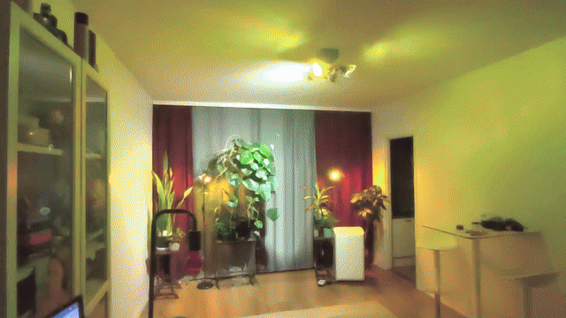

# Airam Music Lights


**Contents**

- 🇫🇮 [**Suomeksi** - lyhyt kuvaus suomeksi](#suomeksi)
- [Demo videos](#demo-videos)
- [1. How this works (architecture)](#1-how-this-works-architecture)
- [2. Local control of the Airam bulbs - what's confirmed vs. assumed](#2-local-control-of-the-airam-bulbs---whats-confirmed-vs-assumed)
- [3. Installation](#3-installation) (prebuilt Windows exe, or from source on Windows or Linux)
- [4. Phase 1: prove local control works on ONE bulb](#4-phase-1-prove-local-control-works-on-one-bulb-do-this-first)
- [5. Running the full application](#5-running-the-full-application)
- [6. Manual (no-music) control app](#6-manual-no-music-control-app)
- [7. Why it feels smooth instead of "crude" like the Airam app](#7-why-it-feels-smooth-instead-of-crude-like-the-airam-app)
- [8. Update rates - independently configurable](#8-update-rates---independently-configurable)
- [9. Running the tests](#9-running-the-tests)
- [10. Development phases (status)](#10-development-phases-status)
- [11. Known limitations / honest caveats](#11-known-limitations--honest-caveats)
- [License](#license) (MIT)
    
A desktop application - for Windows, and run from source also on Linux - that turns **Airam SmartHome Smart PAR16 RGB GU10**
Wi-Fi spotlights into a real-time, fully configurable music visualizer - controlled
entirely over your **local network**, with no cloud dependency at runtime and no
Android phone required. Works with any number of lamps, from one to as many as your
Wi-Fi network and Tuya account can handle - the author's own setup runs 8, but nothing
in the app assumes that specific number anywhere. Audio normally comes from loopback
capture of whatever the PC is playing (WASAPI loopback on Windows, the output's monitor
source on PulseAudio / PipeWire on Linux - no microphone needed), but a real microphone
can be selected instead if you want to test how the lights react to actual room/ambient
sound.

It replaces the Airam SmartHome app's built-in "Music Sync" (which is limited to one
bulb at a time and changes colors abruptly) with your own local FFT-based analysis,
smooth attack/release color interpolation, and simultaneous, synchronized control of
every lamp you own.

**Compatibility:** developed and tested with **Airam SmartHome Smart PAR16 RGB GU10**
spots. The app talks to the bulbs through tinytuya's generic Tuya bulb interface and
nothing in it is specific to that model, so other Tuya-based RGB bulbs (e.g. **Airam
SmartHome E27 RGB bulbs**, or other **Smart Life / Tuya-compatible** RGB bulbs) *should*
work too - but they haven't been tested yet. If you try one, please open an issue and
report whether it worked!

**Download:** a ready-to-run Windows build (no Python needed) is available on the
[Releases page](https://github.com/juhaj77/tuya-music-sync/releases/latest) - see
[Installation](#3-installation).

**Linux:** supported too, run from source - the music is captured from PulseAudio /
PipeWire (the output's monitor, no extra setup), everything else is the same code as on
Windows. See [Option C: run from source (Linux)](#option-c-run-from-source-linux). This
part is new and hasn't been run on a real Linux desktop yet, so reports are very welcome.

> **Beat Sync is the most interesting mode - and the default.** Of all the
> color-mapping modes, it's the one that consistently feels the most visually alive in
> practice - a percussive flash-and-decay on every beat, optionally with **dark pulses**
> (a rhythm-synced pause before the flash, off by default) and **white pulses** (a
> hi-hat/cymbal-style accent, **on by default** with tuned timing - a real flash to the
> **RGBCCT** bulb's dedicated white LEDs via its physical WHITE work_mode at the pulse's
> peak, not just an RGB approximation, with warm and cool white flashes mixed in an
> adjustable ratio rather than one fixed color temperature every time),
> instead of the continuous, sometimes-muted blending the other modes do. It also ships
> paired with the **Chase / Rotating Light overlay** enabled
> by default, set to **complementary** color - a highlight that rotates through your
> chase-ordered lamps always showing the opposite hue of whatever Beat Sync just put
> there, so the combination stays visually varied instead of settling into one static
> look. See [section 5](#5-running-the-full-application) for the full writeup, or jump
> straight to [Beat Sync mode](#beat-sync-mode) or the
> [Chase overlay](#chase--rotating-light-overlay). The Chase highlight's **width**
> should scale with how many lamps are in the chase - see that section for a starting
> formula; the shipped default (1.5) assumes a modest handful of lamps and may want
> adjusting for very small or very large setups.

> **Read `DEVICE_NOTES.md` first.** It separates *confirmed facts*, *assumptions*, and
> *things you still need to test* about your specific bulbs. This README assumes you
> will run Phase 1 (below) against your real hardware before relying on anything else.

## Demo videos

### v1.6 - real-time control (DP 28)

Two newer videos recorded with **v1.6**, which drives the lamps through the real-time
control datapoint (**DP 28**, *Lamp transitions* `direct`). Earlier builds wrote the
persistent colour datapoint (DP 24), where the bulb fades every change itself over about
**0.7 s** - so with DP 28 the effects change far faster and crisper than in the older
videos below. Both run at a **Lamp command rate of 45 commands/s** and both use the
**pulse sequencer**.

- [**v1.6 Chase + Group**](https://github.com/juhaj77/tuya-music-sync/releases/download/v1.6/v1_6_chase.mp4) -
  Chase and Group Switch layered on top of each other: the chase rotates with a
  **hue shift** while the groups switch to the **complementary color**. Admittedly
  there's almost too much going on at once - it's a showcase of how fast the lamps now
  react rather than a tasteful everyday setting.
- [**v1.6 Group**](https://github.com/juhaj77/tuya-music-sync/releases/download/v1.6/v1_6_group.mp4) -
  Group Switch effects only, used both for the **white pulses** and for the
  **complementary color**.

### Earlier videos (DP 24, ~0.7 s bulb fades)

Three demo videos show the app running against real hardware: **8 Airam spots**, 4 in the
ceiling and 4 along the walls. All are running in **Beat Sync** mode with **true white
pulses** enabled.

- [**Chase**](https://github.com/juhaj77/tuya-music-sync/releases/download/v1.0-demo/chase.mp4) -
  a rotating complementary color chasing around all the spots.
- [**Group**](https://github.com/juhaj77/tuya-music-sync/releases/download/v1.0-demo/group.mp4) -
  the ceiling spots form one group and the wall spots another, with a complementary
  color effect between the two groups.
- [**3 groups**](https://github.com/juhaj77/tuya-music-sync/releases/download/v1.0-demo/3_groups_demo.mp4) -
  the spots are split into **three groups**. Unlike the two videos above, this one was
  filmed on a **Xiaomi 14T in Pro mode with fixed white balance and fixed ISO**, so the
  camera isn't fighting the lights (see the note below) - it's a much more faithful
  capture of the actual colors and the snappiness of the beat-synced flashes/pulses.

(The videos are hosted as GitHub Release assets - GitHub's in-repo file viewer refuses
to preview video files past a few MB, so they aren't committed directly into the repo.)

> **Heads up:** the Chase and Group videos were filmed on a phone in auto mode, and the
> phone's camera continuously auto-adjusts exposure and white balance while recording -
> it's constantly trying to "correct" what it thinks is a color cast or an
> under/overexposed scene. That fights directly against what the lights are actually doing, so the videos **undersell the
> real effect**: color transitions look laggier/smoother than they are (the camera is
> chasing them), whites and saturated hues can look shifted or washed out, and fast
> brightness changes (e.g. Beat Sync flashes) get flattened as the camera's exposure
> hunts to compensate. In person, colors are more saturated, whites are actually white,
> and the beat-synced flashes/pulses are far snappier than the videos suggest. If your
> phone lets you lock AE/AWB (exposure and white balance) before recording, that will
> get you a much more accurate capture.

**At a glance:**

- **100% local control** - WASAPI loopback audio (or a real microphone, if you want
  to test with room sound) + local Tuya LAN protocol, no cloud round-trip and no
  companion app needed once set up.
- **Six color-mapping modes**: **Beat Sync** - the main mode, with the shared beat clock,
  the pulse sequencer, optional **dark pulses** and **white pulses** - then Beat Sync
  White, Peak Flash, RGB Frequency, HSV Music and 8-Band Spectrum, plus a Custom mode for
  arbitrary frequency ranges.
- **Per-lamp control**: band assignment, phase offset, and independent
  brightness/saturation/hue/sensitivity multipliers for every lamp.
- **Chase / Rotating Light overlay** - a moving highlight (reversible, adjustable
  width/speed/falloff curve, optionally beat- or peak-synced) layered on top of any
  mode - **on by default**, paired with Beat Sync (see above).
- **Group Switch overlay** - a discrete alternative to Chase: lamps are grouped
  (independently of Chase's own grouping) and exactly one group is fully "active" at a
  time with a hard, instant switch instead of a gradient - useful when you want a clean
  on/off alternation between lamp groups rather than a traveling highlight. Can run at
  the same time as Chase.
- **Ambient Scenes** - synchronized, PC-driven looping animations (color cycle,
  breathing, color-temperature breathing) that solve multi-lamp sync properly instead
  of power-cycling smart plugs.
- **Standalone manual control app** (`manual_control.py`) for audio-free color/white/
  chase/ambient control, sharing one config file with the music visualizer.
- **Works with any number of lamps** - nothing in the app hardcodes a specific count.
- **Crash-resilient persistence** - autosaves every 20s, restores your exact last state
  (including the manual app's last-picked color) on restart.
- **Keeps the PC awake** while either app is open, without blocking manual sleep.

Both apps (`main.py` and `manual_control.py`) prevent the PC from **automatically**
going to sleep while they're open (`airam_lights/keep_awake.py`: Windows'
`SetThreadExecutionState` API, or on Linux a `systemd-inhibit` sleep lock) - a full system sleep pauses every process at the
hardware level (CPU, network, everything), so there is no way to "keep working through"
one; the only real fix is asking Windows not to idle-sleep in the first place. The
display can still turn off / the session can still lock (that doesn't stop the app),
and this only blocks *automatic, idle-timeout* sleep - manually choosing Sleep from the
Start menu, or a laptop's own lid-close power-plan action, still works as normal. If a
laptop's Wi-Fi adapter still seems to drop out from under an otherwise-awake PC, check
Device Manager -> your Wi-Fi adapter -> Power Management -> "Allow the computer to turn
off this device to save power" (uncheck it) - that's a separate, adapter-level setting
this API does not control.

## Suomeksi

**Airam Music Lights** on Windows-sovellus (toimii lähdekoodista ajettuna myös
Linuxilla), joka synkronoi **Airam SmartHome
-älylamput** (Smart PAR16 RGB GU10 -kohdevalot) musiikkiin reaaliajassa: valot
vaihtavat väriä ja välähtävät musiikin tahdissa. Sovellus ohjaa lamppuja suoraan
kotiverkon kautta ilman pilvipalvelua, ja se ohjaa kaikkia lamppuja yhtä aikaa ja
synkronoidusti, toisin kuin Airam SmartHome -sovelluksen oma musiikkitila, joka toimii
vain yhdellä lampulla kerrallaan. Mukana on myös erillinen sovellus valojen käsiohjaukseen
(värit, valkoinen valo, kiertävä valo, tunnelmavalaistus) ilman musiikkia. Muiden
Tuya-pohjaisten RGB-lamppujen (esim. Airamin E27-älylamput) pitäisi toimia myös, mutta
niitä ei ole vielä testattu. Valmis Windows-versio löytyy
[Releases-sivulta](https://github.com/juhaj77/tuya-music-sync/releases/latest).

---

## 1. How this works (architecture)

```
 WASAPI loopback -> FFT / DSP -> Color Mapping -> Per-Lamp Effects -> Lamp Manager -> N Airam bulbs (LAN)
   (audio/)         (dsp/)        (color/)          (engine/)          (lamps/)
```

- **audio/** - WASAPI loopback capture ("what you hear"), decoupled ring buffer.
- **dsp/** - windowed FFT, configurable frequency-band energy extraction, spectral
  centroid/contrast, attack/release smoothing. Pure numpy, no UI/network dependency.
- **color/** - RGB / HSV / 8-band color mapping. Pure functions on floats, no
  dependency on audio or Tuya code, so it can be (and is) unit-tested in isolation.
- **lamps/** - local Tuya (tinytuya) device control, LAN discovery, one worker thread
  per lamp with independent rate limiting and change-thresholding.
- **engine/** - ties the above together via two independently-configurable update
  loops (audio analysis rate vs. visual/smoothing rate); lamp command rate is enforced
  separately again, inside the lamp manager.
- **effects/** - the Chase/rotating-light overlay (`chase.py`), shared between the music
  visualizer and the standalone manual control app (see below) so it only exists once.
- **config/** - JSON configuration (devices, groups, presets, DSP/color settings).
- **diagnostics/** - logging + runtime rate/latency metrics, shown in the Diagnostics tab.
- **ui/** - PySide6 desktop UI (5 tabs: Visualizer, Devices & Setup, Color Mapping,
  8-Band & Per-Lamp, Diagnostics).

The DSP/color engine has **zero import dependency** on the lamp/Tuya layer, and vice
versa - you can develop/test the visualization math with `pytest` alone, no bulbs
required (see `tests/`).

---

## 2. Local control of the Airam bulbs - what's confirmed vs. assumed

See `DEVICE_NOTES.md` for the full breakdown, including the exact confirmed datapoint
(DP) table. Short version:

- **Confirmed end-to-end against real hardware**: local LAN control (no cloud
  round-trip) works, including full RGB color/brightness/power control, verified via
  `tools/phase1_test.py`'s red/green/blue/white cycle on a physical bulb.
- Airam SmartHome bulbs are Wi-Fi-only, no hub - this matches the product page.
- They are built on the **Tuya IoT platform** (product ID `cawpuqfm0ed5ykfj`), using DP
  layout "Type B" (`switch_led`=20, `work_mode`=21, `bright_value_v2`=22,
  `temp_value_v2`=23, `colour_data_v2`=24) - confirmed directly from the bulbs' own
  local `status()` response, not assumed.
- Tuya devices of this class expose a **local LAN protocol** (TCP port 6668,
  encrypted with a per-device `local_key`). This app uses
  [`tinytuya`](https://github.com/jasonacox/tinytuya), a mature open-source
  implementation of that protocol, instead of inventing anything.
- **No datapoint IDs are hardcoded anywhere in this codebase.** Color/brightness/power
  control goes through `tinytuya.BulbDevice`, which reads each bulb's own `status()`
  response and adapts to whatever layout it actually reports. The diagnostics tooling
  (Phase 1 script and the app's Diagnostics tab) always shows you the *real* raw
  datapoints your bulbs return.
- The Tuya cloud API is used for **exactly one thing, once, offline from the
  visualizer**: extracting each bulb's `local_key` during setup, because Tuya does not
  broadcast that key on the LAN for security reasons. All runtime traffic (audio
  analysis -> color -> lamp commands) is 100% local LAN, no cloud round-trip.
- **Still not independently verified against real hardware**: the WHITE work_mode
  control path used by Beat Sync White, White Balance, and White Chase
  (`LampDevice.set_white()`). The DP layout it uses is the same confirmed table above,
  but the specific `tinytuya` calls have not yet been run against a physical bulb - test
  this yourself via the manual app's White Balance tab before relying on it. RGB color
  control is fully confirmed and is what every other mode uses.

---

## 3. Installation

### Option A: prebuilt Windows build (no Python needed)

Download the latest `AiramMusicLights-*-windows-x64.zip` from the
[Releases page](https://github.com/juhaj77/tuya-music-sync/releases/latest), unzip
it anywhere, and run the exes inside the folder:

- `AiramMusicLights.exe` - the music visualizer (same as `python main.py`)
- `AiramManualControl.exe` - the manual control app (same as `python manual_control.py`)
- `AiramSetupWizard.exe` - the one-time local_key setup (same as
  `python tools\setup_wizard.py`, see [4.2](#42-obtain-each-bulbs-local_key-one-time-via-the-tuya-cloud))

Keep the exes in the unzipped folder - they share the libraries next to them. Windows
SmartScreen may warn about an unrecognized app since the build isn't code-signed;
choose **More info -> Run anyway**. The wizard writes tinytuya's `devices.json` (which
contains your local keys) into the folder you run it from - delete it afterwards if you
don't want the keys lying around.

### Option B: run from source (Windows)

Requires **Python 3.10+** on Windows (tested with recent CPython 3.x; PySide6 and
PyAudioWPatch both ship Windows wheels).

```powershell
git clone https://github.com/juhaj77/tuya-music-sync.git
cd tuya-music-sync
python -m venv .venv
.venv\Scripts\activate
pip install -r requirements.txt
```

For running the automated tests too:

```powershell
pip install -r requirements-dev.txt
```

To build the Option A exes yourself (output goes to `dist\AiramMusicLights\`):

```powershell
pip install pyinstaller
pyinstaller airam_lights.spec
```

### Option C: run from source (Linux)

Requires **Python 3.10+** and a desktop with **PulseAudio**, or **PipeWire** with its
PulseAudio server (`pipewire-pulse`) - which is what current Ubuntu, Fedora, Debian and
similar distributions run out of the box. There is no prebuilt Linux build.

```bash
git clone https://github.com/juhaj77/tuya-music-sync.git
cd tuya-music-sync
python3 -m venv .venv
source .venv/bin/activate
pip install -r requirements.txt
python main.py
```

The same `requirements.txt` works on both systems: pip installs the audio library that
fits the operating system (PyAudioWPatch on Windows, `soundcard` on Linux), and the app
picks the matching one at runtime (`airam_lights/audio/devices.py`, `audio_backend()`).
Everything else - lamp control, the effects, the UI - is the same code on both.

What differs on Linux:

- **Audio source.** *Loopback* lists each output's **monitor** source ("Monitor of
  ..."), the default being the monitor of your default output - the Linux counterpart
  of WASAPI loopback. *Microphone* lists the real recording devices.
- **Settings and logs** live in `~/.config/AiramMusicLights/` (or under
  `$XDG_CONFIG_HOME`) instead of `%APPDATA%\AiramMusicLights\` - wherever this README
  mentions the `%APPDATA%` path.
- **Commands** in this README are written for PowerShell; on Linux use `python3` and
  forward slashes (`python3 tools/setup_wizard.py`).
- **Keep-awake** uses a `systemd-inhibit` sleep lock; without systemd-logind the app
  still runs, it just can't stop the PC from auto-suspending.

Linux support is newer and less proven than the Windows side: audio capture has been
verified against a PulseAudio server (monitor capture, device selection, latency around
10-20 ms), but not yet on PipeWire or with real sound hardware, and the keep-awake lock
is untested on a real desktop. If something doesn't work, please open an issue.

---

## 4. Phase 1: prove local control works on ONE bulb (do this first)

Don't skip this - it's the whole point of "don't invent undocumented datapoints."

### 4.1 Find your bulb's IP / device ID on the LAN

```powershell
python tools\scan_devices.py
```

This broadcasts a UDP discovery packet and lists every Tuya device that answers, with
IP, device ID, and protocol version. It does **not** give you the `local_key` - Tuya
never broadcasts that on the LAN.

### 4.2 Obtain each bulb's `local_key` (one-time, via the Tuya cloud)

```powershell
python tools\setup_wizard.py
```

This launches `tinytuya`'s interactive setup wizard, which needs a **free** Tuya IoT
Platform developer account linked to a **Smart Life** app account:

> **Important:** the bulbs must be paired with the **Smart Life** app (Tuya's own
> app), not the Airam SmartHome app. Linking the Airam SmartHome app account to the
> Tuya IoT Platform does not work, so the bulbs can't be added to the Cloud
> Development project that way. Install Smart Life, create an account, and pair the
> bulbs there (remove them from the Airam SmartHome app first if they are already
> paired to it).

1. Create an account at <https://iot.tuya.com> and create a **Cloud Development**
   project (any region close to Finland, e.g. Western Europe / Central Europe).
2. In that project, subscribe to the **IoT Core** and **Authorization** APIs (under
   "Service API" - both are free-tier).
3. Go to **Cloud -> \[your project\] -> Devices -> Link Tuya App Account**, and scan
   the QR code shown there **using the Smart Life app** (the scan icon in the top
   corner of the Me / Home tab) with the account the bulbs are paired to. Scanning
   with the Airam SmartHome app does not work. Your bulbs should now be listed as
   linked devices in the Tuya IoT Platform.
4. Run the wizard above; it asks for your **Access ID**, **Access Secret** (both shown
   on your Cloud project's Overview page), the **data center region**, and your
   account UID (shown next to the linked app account). It then downloads a
   `devices.json` with every device's `local_key` and writes it locally.
5. `tools\setup_wizard.py` automatically imports that into the app's own config file
   (`%APPDATA%\AiramMusicLights\config.json`) and never prints the keys to the
   console.

If this linking step doesn't work for your Airam account for any reason, you can also
obtain a bulb's `local_key` through other local-Tuya tooling you may already have used
(e.g. Home Assistant's Tuya Local integration config flow) and enter it manually in the
app's **Devices** tab instead - the app never requires the wizard specifically, only a
valid `(device_id, ip, local_key, version)` tuple per bulb.

### 4.3 Test ONE bulb manually

```powershell
python tools\phase1_test.py --device "Lamp 1"
```

or, without touching the config file at all:

```powershell
python tools\phase1_test.py --ip 192.168.1.50 --id eb3f... --key 0123456789abcdef
```

This prints:

- online/offline
- the **raw datapoints** your bulb actually returned (not an assumption)
- detected bulb type (A/B/C - see `DEVICE_NOTES.md`)
- measured command latency
- then cycles the bulb red -> green -> blue -> white so you can visually confirm local
  RGB control genuinely works.

Once this passes, update the confirmation table in `DEVICE_NOTES.md` and move on.

---

## 5. Running the full application

```powershell
python main.py
```

### Visualizer tab
Pick your audio **Source**: loopback (default - your current default playback
device, no microphone involved; WASAPI loopback on Windows, the output's monitor on
Linux) or **Microphone** (a real recording device, for testing
how the lights react to actual room/ambient sound - has its own sensitivity/gain
control, since mics are usually much quieter than a loopback tap). Watch the level
meter and spectrum to confirm audio capture works, choose a mode, tweak
sensitivity/brightness/saturation/attack/release, and press **Start Music
Visualization**.

> **Heads up:** the "Sensitivity" quick control here is shared across RGB Frequency,
> Custom, *and* HSV Music mode - dragging it down affects all three at once. If those
> modes suddenly look dim/black, check this slider before assuming something's wrong;
> it defaults to 1.0.

### Devices & Setup tab
Add lamps manually (or via **Scan Network** for IP/ID, then fill in the key), test
connection/RGB/power per device, rename them, select exactly which ones participate
in visualization, and save/apply named groups (e.g. "All Lamps", "Ceiling", "Left side").
The lamp list, chase rotators, and every per-lamp table scale to however many devices
you've added - there is no fixed lamp count anywhere in the app.

**When one lamp won't respond** (but still works in the phone app - which goes through
the Tuya cloud, not your LAN): the app first rebuilds the connection itself; if that
doesn't help, it leaves the lamp out of the show, logs the actual reason once, and
checks it again every 15 s - the rest of the lamps keep playing, and the lamp rejoins
automatically as soon as it answers. While checking, it also fixes the two causes that
don't go away on their own:

- **New IP address** (DHCP): it looks for the lamp on the network and updates the IP.
- **New local key** (the lamp was reset and re-paired in the phone app): it fetches the
  current key from the Tuya cloud, using the credentials the setup wizard saved in
  `tinytuya.json`. **Refresh keys from Tuya cloud** in this tab does the same for every
  lamp on demand.

If the error is `Err 914` and the key in the cloud hasn't changed, the lamp's own local
connection is stuck - switch it off and on at the wall switch; the app picks it up again
within ~15 s without a restart.

**Lamp transitions: instant vs. faded changes.** The bulbs have two ways to take a color.
The persistent colour datapoint (DP 24), which earlier builds used, makes the bulb fade
every change itself over roughly **0.7 s** - measured on video with an Airam PAR16 - so
at a typical dance tempo (a beat every ~0.4 s) the light never actually arrives before
the next beat, flashes blur, and white flashes need 4-5 commands (switch work_mode to
white, brightness, temperature, and back). The real-time control datapoint (DP 28,
`control_data`) takes a change instantly (within one 30 fps video frame) and lights the
white LEDs directly with a single command, without switching work_mode. **Lamp
transitions** (Color Mapping tab, Global box) picks the way:

- `direct` (default) - DP 28 without fade: crisp flashes, beats and white pulses.
- `smooth` (experimental) - DP 28, chosen per command: a big change (a beat's flash, a
  white flash lighting up, the strobe) lands instantly like `direct`, while the small
  steps of a brightness fade, a hue snap or a hue glide are sent with the bulb's own
  short fade - so the bulb glides from one step to the next instead of showing every
  command as a tiny jump. Fades look smoother and a little slower.
- `gradient` - DP 28 with the bulb's own short fade (~0.25 s) on every change.
- `legacy` - DP 24 and work_mode switching, as before (~0.7 s fades).

With `direct` every command shows as a step, so smooth fades and hue glides
want a higher **Lamp command rate** (up to 60/s; the color engine computes at least that
often) - or `smooth`, which lets the bulb fill in between the steps. Colours go out at
the datapoint's own resolution (hue in degrees, saturation and brightness in 0.1 %
steps), not rounded through 8-bit RGB. A white flash's brightness really follows *White pulse attack* /
*release* (it swells in and fades out) instead of the bulb's own fade. The bulbs can
show colour and white at the same time on DP 28, so a flash is a **crossfade**: the
colour dims as the white swells and comes back as it fades - the lamp never drops to
dark around a flash.

Only bulbs with the v2 datapoint layout (like the Airam ones) use DP 28; others always
use `legacy`. If your bulbs stop changing color with `direct`/`gradient`, choose `legacy`.
Worth knowing: a warm white takes longer to build up than a cool one (~0.5 s), so very
short warm flashes come out dimmer than cool ones.

**When a lamp looks online but ignores the show.** Some bulbs occasionally get into a
state where they still answer status queries - so they look perfectly online - but
silently ignore every control command. Colour commands are sent without waiting for an
acknowledgement (waiting would slow every command down), so nothing fails on the app's
side either: no error, nothing in the log. The phone app keeps working (through the
cloud), and only switching the lamp off and on at the wall brings it back. This looks
like a known weakness of the bulbs' local network handling under a long, dense stream
of commands; how much the show's command rate contributes isn't settled yet - it has
happened with and without *Glide hue*.

The app now watches for it: every status refresh (~4 s) compares what the lamp *reports*
it's showing with what it was sent. (The bulb never reports colors sent through DP 28,
so with `direct`/`gradient` transitions the current color is also written to DP 24 once
every 5 s, and the check compares against those writes.) A lamp that keeps reporting the exact same color
while the show sends it plenty of different ones is flagged as **not following
commands**:

1. The app logs a warning and rebuilds the connection once.
2. If that doesn't help, the lamp is left out of the show and shown as offline in the
   Devices tab with the reason ("...switch the lamp off and on at the wall switch"). It's
   re-checked every 15 s by sending it a test color and reading back what it shows - once
   it obeys again (e.g. after the power-cycle), it rejoins the show by itself.

Each time, the log (`%APPDATA%\AiramMusicLights\logs\app.log`; search for `not following`
or `stuck-lamp report`) records what that lamp had been put through, for example:

```
'OV' (192.168.1.241) is not following commands - ... Rebuilding its connection.
[18.4 commands/s over the last 60s (1051 colour, 52 white, 97 colour<->white switches),
connected for 41.3 min; show: mode=beat_sync, fade=on, glide_hue=beat, white_pulses=on,
sequencer=on, chase=clock, group_switch=clock, lamp_command_rate=20/s, min_change=0.015]
```

After a few of these it's possible to see what stuck lamps have in common - whether it's
always the same lamp, the command rate, the number of white switches, glide on or off, or
simply time. If stuck lamps turn out to follow the load, lowering **Lamp command rate**
(e.g. to 10/s) or raising **Min change threshold** (Color Mapping tab, Global box)
reduces it.

### Color Mapping tab
Full detail for **RGB Frequency** and **Custom** modes (per-channel frequency range,
gain, min/max level, gamma - both modes are literally the same mechanism, Custom just
unlocks arbitrary ranges instead of the bass/mid/treble defaults), **HSV Music**
mode (hue from spectral centroid, brightness from overall energy, saturation from
spectral contrast), and **Beat Sync** mode (see below). Also: response curve
(linear/log/exp2), the network's min-change threshold, mapping presets, and
**Invert brightness** - a single checkbox in the Global section that flips the
brightness response for every mode at once (0 becomes bright, 1 becomes black), for
when you want quiet passages to light up and loud/energetic moments to go dark instead
of the usual way around.

#### Rhythm: the shared beat clock
Beat Sync, Chase and Group Switch can each run their own beat detector - but then the
same drum hit may advance one layer and not another, or advance them on different
frames, and the combined show reads as three unrelated rhythms (i.e. random). The
**Rhythm** box at the top of the tab adds one shared detector that every layer can
follow instead (`airam_lights/dsp/beat_clock.py`):

- **Tempo lock** - estimates the tempo from the last few seconds of the kick-drum band,
  then only accepts hits near the expected beat (off-beat hi-hats, snares and vocals are
  ignored) and fills in a beat when a kick is too quiet to detect, so the rhythm stays
  regular.
- **Lead time** - once locked, each beat is sent this many milliseconds early, cancelling
  out the Wi-Fi + bulb reaction delay (~100-150 ms) so flashes land *on* the beat instead
  of just after it. Raise it if flashes look late, lower it if they look early.
- **Bars and accents** - beats are counted in bars (`Beats per bar`, 4 by default), with
  the bar start placed on the position that usually hits hardest. The hardest hits are
  flagged as accents.

What follows the clock:

- **Beat Sync** (checkbox *Beat Sync follows the shared clock*) - flashes on the clock's
  beats. **Change hue every N beats** keeps a color for several beats (4 = one color per
  bar) instead of a new color on every hit. Dark and white pulses get a trigger:
  `random` (every beat rolls the probability, as before), `accent` (only the hardest
  hits) or `downbeat` (only bar starts).
- **Chase / Group Switch** - Speed source `clock`, moving every N beats counted from the
  bar start (e.g. Chase every beat, Group Switch once per bar).

The status line under the Rhythm box shows the detected tempo, whether it's locked, and
the current beat in the bar.

Settings that don't do anything in the current combination are **greyed out**, with the
reason in their tooltip and a short note next to them - e.g. Beat Sync's own detection
band while it follows the shared clock, a Chase's beat detector while its Speed source
is `clock`, or *Sustain brightness* while *Fade brightness* is off. Rhythm divisions are chosen from
values that line up with the bar - *every beat*, *every 2 beats*, *every bar*, *every 2
bars*... following *Beats per bar* - and phrases from 1/2/4/8/16 bars, so a setting can't
drift against the music (e.g. "every 3 beats" in 4/4 would land on a different beat of
each bar).

#### Between beats: fade brightness and/or glide hue
Beat Sync's **Between beats** row picks what moves after each flash - either, both or
neither:

- **Fade brightness** (on by default) - the classic flash that fades toward *Sustain
  brightness*. Off: brightness stays at *Flash brightness* the whole time (dark pulses
  still dip it). On RGB+CCT bulbs the colored LEDs are much dimmer than the white ones, so
  this keeps the colored light - and what reflects off the walls - at full strength.
- **Glide hue** - after each beat the color travels *Glide distance* degrees toward the
  next color, and the next beat lands on that color. With *Glide timing* `beat` it moves
  evenly through the whole beat (following the tempo), so the color wheel keeps turning
  in time with the music; `decay` follows the brightness attack/decay instead - a quick
  sweep right after the hit. A distance of about the Hue step arrives exactly at the next
  color; 360 is a full rainbow every beat.

A gliding color changes on every frame, so lamps receive commands continuously - still
capped per lamp by *Lamp command rate* (20/s by default).

#### Pulse sequencer: white and dark pulses on musical positions
In the Beat Sync tab, the **Pulse sequencer** takes over the white and dark pulses from
the per-beat probability rolls and places them the way a lighting operator (or a
drummer) would, on a 16th-note grid from the shared clock (`effects/pulse_sequencer.py`):

- **Patterns** - which 16ths of the bar flash white: downbeats, every beat, off-beats
  (the "and"), a 3-3-2 syncopation, a gallop, straight 16ths - or `auto`, which follows
  the loudness: sparse when the song is quiet, busier as it gets louder.
- **Group walk** - each white flash goes to the next lamp group (the Group Switch
  groups), so the white travels around the room; *Double chance* sometimes repeats a
  flash in the same group an 8th later.
- **Thinning** - three ways to calm the white flashes down, the way a drummer would
  rather than by random gaps:
  - *Accent focus* drops the light positions first: the 16ths between beats, then the
    "ands", then beats 2 and 4, then beat 3 - the downbeat stays. Busy patterns
    (sixteenths, gallop) calm down without losing the pulse.
  - *Phrase build* starts each phrase sparse and fills it in bar by bar toward the end,
    so the tension builds up to the fill and the phrase-start flash.
  - *Repeat the groove* decides which steps flash (and which double) once per phrase and
    repeats it in every bar, so the eye can follow it; a new variation comes with the
    next phrase. Off, every step is rolled anew and the gaps jump around from bar to bar.
- **Dark pulses** - a breath on the last 16th before the downbeat (and before the
  backbeats, and fast stutters in fills when it's loud), with their own density and
  length.
- **Phrases** - bars are counted in phrases (8 by default - most pop/dance music changes
  something every 8 bars). The end of each phrase gets a fill (denser flashes), a dark
  breath, and every lamp flashes on the new phrase's first beat. A sudden quiet-to-loud
  jump (a drop) starts a new phrase right there.

- **Pulse dynamics** - the white pulse settings (brightness, attack, duration, release)
  are the baseline, and each flash is shaped by where it falls in the music: the downbeat
  long and bright, flashes between beats short and crisp, fills snappier and brighter
  toward the phrase start, the phrase start held longest with a slow fade, quiet parts
  dimmer and softer, loud parts full and sharp. *Dynamics amount* sets how strongly
  (0 = every flash identical).
- **White release curve** (white pulse settings) - the shape of each flash's fade-out,
  best seen with a longer *White pulse release* (a few hundred ms): `linear` (a straight
  fade, as before), `ease_in` (lingers near full, then drops away), `ease_out` (drops
  fast, then a long soft tail, like a struck drum or cymbal), `ease_in_out` (an S-curve).
  `dynamic` lets the sequencer pick per flash, the way an instrument decays:
  `ease_in_out` for the phrase-start flash and in quiet parts, `ease_in` on the heavy
  beats (the light hangs on like a held bass note, then clears for the next beat),
  `ease_out` on the lighter beats, the fills and the doubles (percussive). It shapes the
  sequencer's flashes; the per-beat flashes without the sequencer fade out exponentially,
  and with `legacy` transitions the bulb fades on its own.

The Rhythm status line shows where it is: `beat 2/4 | phrase bar 7/8, loudness: high`.
The *downbeat* (beat 1) is placed on whichever beat of the bar usually hits hardest -
in most dance music that's where the kick is strongest, so it lines up with the real
bar start after a few bars of listening.

#### Built-in looks
**Presets -> Built-in look** sets the shared clock, Beat Sync, the pulse sequencer, Chase
and Group Switch together: *Groove - one color per bar*, *Calm - slow color flow*,
*Club - punchy*, *Dance - white across groups*, *Chase focus* and *Group focus*. They only change rhythm and color behavior - your lamp
groups, Chase width/intensity, Group Switch intensity, beat detection band/sensitivity,
lead time and true-white depth/brightness/cool ratio are left as you set them. Saved
presets (*Save As...*) now also include the Rhythm and Group Switch settings, and loading
any preset updates the sliders right away.

#### Beat Sync mode
The other modes blend colors continuously, which can end up looking muted/washed
toward white if the source material doesn't have big swings between bands. Beat Sync
takes the opposite approach: a simple energy-based beat detector
(`dsp/beat_detector.py`, unit-tested with synthetic pulse trains in
`tests/test_beat_detector.py`) watches one frequency band (kick-drum range, 40-200 Hz,
by default) and on every detected hit jumps the lamps to a **fresh, fully-saturated hue
at full brightness**, then lets brightness decay toward a dim baseline until the next
hit - a percussive flash-and-decay envelope that makes the rhythm obvious instead of a
faint brightness ripple. Three ways to pick the new hue each beat:

- **random** (default): a new hue every hit, forced to differ from the last one by at
  least `min_hue_jump_deg` so you never get two similar colors back to back.
- **step**: advances by a fixed angle each hit (default 137.5°, the "golden angle" -
  cycles through well-spread colors without ever repeating for a long time).
- **spectrum**: hue follows the spectral centroid at the instant of the hit.

`sensitivity` / `min_interval_ms` / `min_energy` tune how trigger-happy the detector
is; `hue snap speed` / `brightness attack` / `brightness decay` tune how sharp vs.
smooth the flash feels. Per-lamp phase offset (8-Band & Per-Lamp tab) still works here
too - stagger it across lamps for a chase/wave effect on every beat.

**Dark pulses**: toggled via `dark_pulse_enabled` (on by default), `dark_pulse_probability`
(0..1) is the chance that a given beat first dips toward black for `dark_pulse_duration_ms`
(how dark, via `dark_pulse_depth`) *before* flashing to its new color, instead of flashing
immediately - a rhythm-synced pause/strobe accent layered on top of the hue and brightness
behavior above, with its own `dark_pulse_attack_ms`/`release_ms` controlling how sharply it
cuts into the pause and eases back out of it (independent of the general `brightness_attack_ms`/
`release_ms` used for the normal flash/decay). Since this is a real-time reactive system, it
can only react to a beat as it happens (it can't anticipate a future one), so the pause always
starts right on the trigger and the actual color flash is simply delayed until the pause ends
- not a pause *before* the hit, but a hesitation *right on* the hit before committing to the
flash.

**White pulses**: independent of dark pulses, `white_pulse_probability` (0..1, **on by
default** - toggle `white_pulse_enabled`) is the chance a given beat's flash *also* gets a
brief white accent, for `white_pulse_duration_ms`, with its own `white_pulse_attack_ms`/
`release_ms` controlling how sharply it snaps in and eases back out. The shipped defaults
(probability 0.26, duration 45ms, attack 17ms, release 49ms, brightness 0.3, temp 0.5) were
tuned live against real hardware until the combination read as musically "in harmony"
rather than a jarring or washed-out accent - a reasonable starting point to tweak from
rather than a neutral/untuned one. Dark and white pulses each roll their own probability
independently on every beat - both, either, or neither can happen on any given hit, so with
both enabled at non-trivial probabilities you'll occasionally see them coincide; that's
expected rather than a bug.

This is always a **"true white" flash**: the lamp switches its physical **WHITE
work_mode** on - the real white diode(s) - at `white_pulse_white_brightness` (default
0.3). White is never mixed from the RGB LEDs: on RGB+CCT bulbs those are much weaker than
the white ones, so all their output stays reserved for color (earlier builds had an
RGB-desaturation variant and an "invert" option; they're gone, and their saved settings
are ignored).
Each flash also independently rolls **warm vs. cool** white: `white_pulse_cool_ratio`
(default 0.5) is the chance a given flash lands on cool white instead of warm (0.0 =
always warm, 1.0 = always cool, 0.5 = a roughly even, unpredictable mix) - the roll happens
once per new flash, tied to the same beat trigger as everything else in Beat Sync mode, and
holds for that flash's whole duration rather than flickering mid-flight, so consecutive
white accents read as varied instead of visually identical every time. **Warm/cool** chooses how that
temperature is picked (anywhere between warm and cool, not just the two ends): `random`
(the cool-ratio roll above), `bar` (by the weight of the beat - the downbeat coolest, the
bar's middle beat half-cool, the other beats warmer, flashes between beats warmest, so the
heavy beats stand out), `alternate` (cool, warm, cool...), `loudness` (warm in the quiet
parts of a song, cool in the loud ones) or `phrase` (cooling down over each phrase toward
its end; the new phrase's first flash is cool, then back to warm). `bar` and `phrase` need
the shared beat clock to know where the bar is. It then switches
back to RGB colour mode once the pulse ends and resumes
wherever the normal Beat Sync hue/brightness envelope has evolved to in the meantime - the
show continues exactly where it left off, it's just been briefly interrupted by a real
white flash. On a dense/fast track, several short flashes can chain closely enough that
the lamps would otherwise stay in WHITE work_mode almost continuously for a stretch - a
hard safety ceiling forces a real, guaranteed-length RGB-only window at least every 1.5s
of continuous white time, so a lamp can never end up looking stuck in white regardless of
how the beats line up. By default every selected lamp flashes white together;
`white_pulse_target` (**True white lamps** in the UI) can instead limit the flash to just
the lamps the **Chase** highlight is currently on (`chase`) or to Group Switch's currently
active group (`group`) - the lamps are picked when the flash starts and held for its
duration, and it falls back to all lamps if that effect isn't enabled. Following the Chase
highlight skips lamps whenever Chase moves more than one lamp between two flashes; `rotate`
avoids that by giving the white its **own rotation** through the Chase order: every flash
moves exactly one lamp on (in the same direction as Chase), however fast Chase itself
moves. **Rotating** next to it sets how many lamps flash at once - 1, 2 on opposite sides,
or 3/4 evenly spaced - and applies to the pulse sequencer's walk too, which can step
through either the Group Switch groups or the Chase order (*Walk through*). The per-lamp
**True white x** column (`white_pulse_brightness_mult`) scales an individual lamp's
true-white brightness relative to the global setting (0.5 = half) - give every lamp in a
group the same value to balance, say, wall spots next to plants against the ceiling group;
the ratio holds when you change the global brightness. The white flash uses the bulb's
WHITE work_mode DP, same as Beat Sync White mode - see [section 2](#2-local-control-of-the-airam-bulbs---whats-confirmed-vs-assumed)
for what's confirmed vs. still-unverified about that path on real hardware.

#### Peak Flash mode
A softer, more continuous cousin of Beat Sync. Instead of a fixed bass-only trigger and
a hue that only changes on a beat, Peak Flash:

- Detects peaks across the **whole spectrum** by default (not just bass), so it reacts
  to any sudden loud moment - kicks, snares, vocal hits, sung notes, anything.
- Blends the color toward **pure white** in proportion to treble/cymbal/sibilance
  energy (`treble_low_hz`-`treble_high_hz`, default 5-16 kHz) - hit a crash cymbal or a
  bright hi-hat and the lamps flash white; when the treble drops back down they return
  to full color. This is a smooth blend (`white attack`/`white release`), not a hard
  switch.
- Keeps brightness **continuously tracking overall loudness** (`baseline brightness
  min/max`) between peaks, with a sharp `flash brightness` boost exactly on each
  detected peak that decays back down (`flash attack`/`flash decay`) - so the lights
  breathe with the music's overall intensity, not just jump on/off.
- Never snaps hue discretely - it **flows continuously**, either as a slow autonomous
  rotation (`hue_source: drift`, speed via `drift speed`) or by continuously following
  the spectral centroid (`hue_source: centroid`). The key control here is **"Color
  richness (hue flow)"**: a smoothing time constant (hundreds of ms up to ~15s) that is
  the actual math behind the "smooth blend" / storytelling feel you get by turning it
  up - higher values make the color arc unfold slowly and richly over an entire song
  section; lower values make it dance more quickly.

Net effect: vivid, maximally saturated color most of the time, punctuated by white
flashes on cymbals/treble peaks and brightness swells tracking the music's energy,
while the underlying hue keeps telling a slow, continuous color "story" instead of
jumping around.

#### Beat Sync White mode
The same rhythm-reactive envelope as Beat Sync (including dark pulses), but drives the
bulb's **WHITE work_mode** (brightness + color temperature) instead of RGB - the lamps
stay genuinely white, animating warm<->cool on the beat rather than jumping between
colors. `temp_mode: random` picks a new temperature every hit (forced to differ from
the last one by `min_temp_jump`); `alternate` ping-pongs cleanly between the warm and
cool ends of your configured `temp_min`/`temp_max` range. Everything else (sensitivity,
min interval, flash/sustain brightness, dark pulses) works exactly like Beat Sync.

> This is the newest lamp-control call in the app (`LampDevice.set_white()`) and,
> unlike RGB, has **not yet been independently verified against the physical bulbs** -
> see `DEVICE_NOTES.md`. Test it via the manual app's White Balance tab first.

### 8-Band & Per-Lamp tab
Split into three inner sub-tabs: **Bands & Spectrum**, **Per-Lamp Effects**, and
**Chase Overlay** (a fourth, **Group Switch**, holds that overlay's settings - see
below). Bands & Spectrum edits the 8 frequency bands (defaults to the 20 Hz-12 kHz
split from the spec, one band per lamp) and 8-band appearance (base hue, hue step for a
rainbow look, saturation, brightness range). Per-Lamp Effects has the **per-lamp
effects table**: band assignment, temporal/phase offset (for wave/chase effects),
brightness/saturation/hue/sensitivity multipliers, **chase order**, and **effect group**
(for Group Switch, see below) per lamp - this is what turns a set of identical bulbs
into a coordinated light installation instead of identical copies of the same signal,
and it applies in every mode, not just 8-band.

#### Chase / Rotating Light overlay
An overlay effect layered on top of **whichever color mode is active** (RGB, HSV,
8-Band, Beat Sync, Peak Flash, Custom - all of them), **enabled by default**: give a
lamp a **chase order** (0, 1, 2, ...) in the per-lamp effects table to include it in the
rotation, then a moving highlight travels through them in that order, creating a
spinning/chasing light effect on top of whatever colors the active mode is already
producing.

- **Speed source**: `off` for a constant number of **full rotations per second** (e.g.
  0.5 = one complete lap around all the chase-ordered lamps every 2 seconds, regardless
  of how many lamps are in the chase); `beat` or `intensity_peak` to instead sit still
  and only advance `beat_multiplier` lamp-steps the instant a beat (bass-band, via the
  chase's own independent detector) or a broadband loudness peak is detected - genuinely
  event-driven, not a tempo estimate, so it never drifts on its own between hits.
- **Highlight width**: how many lamp-positions the glow spans (soft falloff). Lower
  (e.g. 0.5-0.8) gives a crisp "single dot traveling" look; higher blurs it across more
  lamps at once. **Scale this with your lamp count**: as a starting point, roughly a
  third of the number of lamps in the chase tends to look smooth without lighting every
  lamp at once (the shipped default, 1.5, assumes a modest handful of lamps - a chase of
  12+ lamps likely wants a noticeably wider highlight, a chase of 2-3 wants it narrower).
- **Intensity**: a brightness *boost multiplier* applied on top of whatever brightness
  the active mode already computed for that lamp - it is never an independent/fixed
  brightness. This matters: a lamp the active mode has deliberately dimmed to black
  (e.g. a Beat Sync dark pulse) stays black no matter how high the intensity or how wide
  the highlight is, since boosting zero brightness is still zero. If the chase feels too
  subtle, raise this (default 3x) rather than expecting it to override a dark moment.
- **Color**: **complementary** (the default, paired with Beat Sync) makes the chase
  highlight's hue the opposite (+180°) of whatever hue that lamp is already showing from
  the active mode - stays visually varied no matter what colors the base mode is
  currently producing. **hue_shift** instead gives each chase position a progressively
  different, fixed hue (a rainbow trail effect, stepped by `hue_shift_step_deg` from
  `custom_hue_deg`). **custom** uses one fixed hue/saturation for the whole highlight -
  for the clearest, most obviously visible effect, pick a hue very different from your
  usual palette (e.g. if your mode tends toward blues/greens, try an orange/red hue
  around 20-40°) combined with a narrow width.
- **Chase dwell x** (per-lamp effects table, one column per lamp): how long the
  highlight lingers at *this lamp's* chase position relative to the others - 1.0 is
  the default/uniform speed. Lower it for a position that has several physical lamps
  sharing one chase order (e.g. a multi-spot ceiling fixture) if the highlight feels
  like it dwells there noticeably longer than at single-lamp positions - which is a
  real perceptual effect (more lamps lit at once reads as "lingering" even though the
  underlying timing is uniform without this), not just something to live with.

#### Group Switch overlay
A **discrete alternative** to the Chase overlay above, in its own sub-tab: instead of a
highlight that gradually blends across neighboring lamps, lamps are grouped by
**effect group** (0, 1, 2, ... - set in the per-lamp effects table, a separate grouping
from Chase's own **chase order**, so a lamp can be in either, both, or neither), and
exactly **one group is fully active at a time** with a hard, instant switch - no
gradient, no partial blend on neighboring groups. Same speed-source model as Chase
(`off` / `beat` / `intensity_peak`, its own independent detector) and the same
custom/complementary/hue_shift color options, but deliberately without a width or
falloff-curve concept, since there's nothing to blend. Can run at the same time as
Chase - Chase applies first, then Group Switch's discrete switch applies on top of
whatever color Chase already produced for that lamp.

**Fade across groups** (off by default) spreads the group color over *all* the groups
instead of showing it on the active one only: the active group still gets the full
group color, the group before it one step less, and so on back to the lamps' own color
- in equal steps around the hue circle, so the in-between groups stay vivid. With three
groups and `complementary` that is own color -> halfway -> the opposite color; with
more groups the steps get smaller (five groups: 0, 45, 90, 135, 180 degrees). The
brightness boost fades the same way, and the whole ramp moves along as the active group
advances - the switch itself is still a hard step. It needs at least three groups (with
two there is nothing in between). White pulses that follow the group
(*True white lamps: group*) still land on the active group only.

**Switch fade** (0 = off, the hard step) softens the switch itself: when the active
group moves on, every group's color glides to its new place over about that long
instead of jumping - a time constant like Beat Sync's *Hue snap speed*, so the same
value gives the same feel. It works with and without *Fade across groups*, and in
`hue_shift` mode the hue glides along too.

### Diagnostics tab
Audio callback rate, FFT/analysis rate, visual update rate, per-lamp online state /
bulb type / latency / command counts (sent, failed, skipped-as-unchanged), current
mode, and a live log viewer.

Configuration (devices, groups, presets, DSP/color settings - including local keys) is
saved automatically on a clean exit to `%APPDATA%\AiramMusicLights\config.json`, in
human-readable JSON, **and** every 20 seconds while the app is running - so nothing
from a session is lost even if the app is killed abruptly (crash, Task Manager, power
loss) instead of closed normally. Both apps (`main.py` and `manual_control.py`) read
and write this exact same file, so anything tuned in one is already there the next time
you open either. This is verified by `tests/test_config_persistence.py` (every field of
every settings dataclass survives a save/reload round-trip, including old config files
saved before newer features existed) and was additionally exercised end-to-end through
the real UI in both apps (set values via the actual widgets, close, reopen a fresh
window, confirm every value - and the widgets displaying them - match).

This includes the manual app's **actual picked static color/white-balance**
(`ManualStateConfig`) - not just the Chase/Ambient/etc. *settings*, but the literal
color you last applied via "Apply to Selected", restored and re-sent to the lamps the
moment the app starts, regardless of what Chase or Ambient happen to be configured to
(see `tests/test_manual_engine.py`). Turning a selection off does not overwrite this -
it's treated as a power state, not a change in your preferred color.

---

## 6. Manual (no-music) control app

```powershell
python manual_control.py
```

A separate, standalone app for controlling the lamps' colors directly, with no audio
capture and no music analysis at all - for when you just want to set a color or run a
lighting effect without playing anything. It shares the **same config file** as
`main.py` (same devices, local keys, per-lamp chase positions, and Chase settings), so
anything you tune in one shows up in the other.

- **Devices & Setup tab** - identical to the music app's (same code, reused as-is):
  add/scan/test lamps, name them, select which participate.
- **Manual Color tab** - pick a color from a color dialog and apply it to whichever
  lamps are currently selected; also Turn On/Off buttons for the selection.
- **White Balance tab** - drives the bulb's WHITE work_mode instead of RGB: set a
  static brightness + color temperature (0=warmest..1=coolest) for the selection, plus
  a **White Chase** effect - a warm-or-cool region (`target_temp`) rotates through the
  chase-ordered lamps instead of an RGB highlight, using the same rotators/width/speed/
  intensity controls and the same position-grouping as the RGB Chase.
- **Chase / Rotating Light tab** - the RGB Chase overlay described below, run on its
  own ~30 Hz timer instead of driven by audio. "Sync to beat" isn't offered here since
  there's no audio to sync to (picking a beat-synced preset in the music app and then
  opening this app just falls back to the constant speed instead of crashing).
- **Ambient Scenes tab** - self-looping animations (see below) that replace the bulb's
  own onboard "scene" animations specifically to solve **synchronization** across
  multiple lamps.

Only one PC-driven animation actually drives the lamps at a time (whichever you
used/enabled most recently - applying a static color or enabling RGB Chase switches to
RGB, applying White Balance or enabling White Chase switches to White, enabling an
Ambient Scene takes over from either), since a bulb can only be in one work_mode at
once and this app only ever runs one animation loop.

#### Ambient Scenes: solving lamp synchronization properly
If you've been setting the bulbs' own built-in animated "scene" in the Airam app on
each lamp individually, then trying to power-cycle a smart plug and a light switch at
the same instant to line them up - stop doing that. It's fighting a fundamental
limitation: each bulb's onboard scene animation runs on its **own internal clock**,
starting whenever it was individually triggered, and there is no command to say "start
now, in sync with these other lamps." Smart plugs' own switch-on latency makes the
power-cycle trick unreliable on top of that.

Ambient Scenes are computed **once per tick, from one shared clock, on the PC**, and
pushed to every selected lamp together on the same network round - so they are
synchronized by construction, with zero timing trickery required:

- **color_cycle** - every lamp sweeps through the full hue wheel together (a
  synchronized rainbow).
- **breathing** - brightness pulses smoothly between a min and max at a fixed hue (RGB).
- **temp_breathing** - the same smooth pulse, but on color temperature instead
  (WHITE work_mode - warm to cool and back).

`Speed` sets how many full cycles happen per second (e.g. 0.1 = one cycle every 10s).
Every lamp defaults to phase offset 0 = perfectly synchronized; the optional per-lamp
"Phase offset (ms)" table lets you deliberately stagger lamps instead, for a traveling
wave look, if you ever want that - but synchronized is the default and the point.

This intentionally does **not** touch the bulb's own scene datapoint (DP 25) - its
on-wire encoding was never independently confirmed for these bulbs (unlike DP 24's
colour format, which was), and using it wouldn't solve the sync problem anyway even if
decoded. See `DEVICE_NOTES.md` for the full reasoning.

The Chase overlay's underlying math (`airam_lights/effects/chase.py`) is shared code
between this app and `main.py`'s music visualizer - a fix or feature there (like the
lamp-position grouping described below) applies to both automatically, they can never
drift apart into two different implementations.

### Chase / Rotating Light overlay (shared by both apps)

Give a lamp a **chase position** (0, 1, 2, ...) - in the manual app's Chase tab, or in
the music app's 8-Band & Per-Lamp tab's per-lamp effects table - to include it in the
rotation, in that order. **Lamps that share the same position number animate
together, as one group** - this matters because your physical lamp layout is usually
not a single ring; e.g. give the two lamps on each of four walls the same position
number (0, 0, 1, 1, 2, 2, 3, 3) and the chase treats each wall as one step, moving
around the room instead of assuming an actual circle of individually-addressable
positions.

- **Number of rotators**: how many highlights travel the loop at once, evenly spaced
  and always moving together - 2 puts them on opposite sides, 3 a third apart, etc.
- **Speed**: full rotations per second (e.g. 0.5 = one lap every 2 seconds), or, in the
  music app only, synced to the detected beat.
- **Reverse direction**: flips which way the highlight travels around the chase order.
  Available on RGB Chase, White Chase, and Ambient Scenes' `color_cycle` (it has no
  visible effect on `breathing`/`temp_breathing`, whose pulse is symmetric in time).
- **Highlight width**: how many chase positions the glow spans (soft falloff) - lower
  is a crisper "single spot" look.
- **Intensity**: a brightness *boost multiplier* on top of each lamp's own current
  brightness - never an independent/fixed value, so a lamp that's off/black stays that
  way no matter the intensity or width (this was a real bug, now fixed and covered by a
  regression test in `tests/test_chase.py`).
- **Falloff curve**: `linear` (constant-rate falloff from the peak - the peak color is a
  single fleeting instant, which can feel like it "flies by" too quickly) or `bezier`
  (an eased S-curve/smoothstep that dwells near the peak color - and near the
  background - for longer, transitioning fastest in the middle). Try `bezier` if a
  chase color feels too brief.
- **Soft steps** + **Switch fade** (off by default): with only a handful of lamps the
  highlight can't really glide - whatever the width and falloff curve, each lamp's color
  changes in visible jumps as the highlight moves on, and jumps outright when it steps
  on a beat. With Soft steps on, every lamp's color fades to its new value over the
  Switch fade time instead (a time constant, like Group Switch's *Switch fade* and Beat
  Sync's *Hue snap speed*). Longer = softer, with a longer trail.
- **Color**: `custom` (a fixed hue/saturation you set), `complementary` (the opposite
  hue of whatever that lamp's own color currently is), or `hue_shift` (each position
  shows a progressively different hue - a rainbow trail as the light travels around).
- **Dwell x** (per-lamp, in the same position table): how long the highlight lingers
  at that lamp's own position relative to the rest of the loop - 1.0 is uniform/
  default. Lower it for a position where several lamps share one chase order (e.g. a
  multi-spot ceiling fixture) if that position feels like it holds the highlight
  noticeably longer than single-lamp positions do; raise it to deliberately make the
  highlight pause somewhere. Applies to both RGB Chase and White Chase, since they
  share the same chase positions.

Presets (Color Mapping tab, music app) capture the full setup, Chase overlay and
per-lamp chase positions included - not just the color mapping mode's own settings.

---

## 7. Why it feels smooth instead of "crude" like the Airam app

Every level (band energy, spectral centroid, brightness, per-lamp output) passes
through **attack/release exponential smoothing**
(`value += (target - value) * alpha`, with `alpha` derived independently from the
attack and release time constants depending on whether the signal is rising or
falling - see `dsp/smoothing.py`). A bass hit can snap up quickly (short attack) while
decaying gently (long release), and every intermediate value is sent, not just the
start/end - e.g. bass going from 30% to 80% actually produces a sequence like
`30 -> 35 -> 42 -> 51 -> 63 -> 74 -> 80`, never a single jump.

On top of that, the network layer independently **rate-limits** each lamp
(`lamp_command_rate_hz`) and **skips sends that are effectively unchanged**
(`min_change_threshold`), so smoothing doesn't turn into needless network spam - see
`lamps/manager.py`.

---

## 8. Update rates - independently configurable

| Stage | Config field | Default |
|---|---|---|
| Audio analysis (FFT) | `audio.analysis_update_hz` | 60 Hz |
| Visual/color/smoothing | `network.visual_update_hz` | 30 Hz |
| Per-lamp network commands | `network.lamp_command_rate_hz` (Color Mapping -> Global: *Lamp command rate*) | 20 Hz (auto backs off on failures) |

These are deliberately separate: the FFT can run faster than the color engine needs,
and the color engine can run faster than any real Wi-Fi bulb can reliably accept
commands. If a lamp starts failing/timing out, its worker thread automatically backs
off (exponentially, capped at 16x its configured interval) without affecting any other
lamp or the UI - each lamp has its own independent worker thread, so this holds
regardless of how many lamps you have.

---

## 9. Running the tests

```powershell
pip install -r requirements-dev.txt
pytest tests/ -v
```

These test the DSP and color-mapping modules in isolation (synthetic sine waves, no
audio hardware; pure float math, no bulbs) - exactly the independence the spec asked
for between the music-analysis engine and the lamp-control layer.

---

## 10. Development phases (status)

- [x] **Phase 1** - local protocol investigation + single-bulb diagnostic script
      (`tools/phase1_test.py`, `tools/scan_devices.py`, `tools/setup_wizard.py`).
- [x] **Phase 2** - multi-lamp device list, selection, naming, groups, manual RGB/power
      test (Devices & Setup tab).
- [x] **Phase 3** - WASAPI loopback audio capture, level meter, spectrum display
      (Visualizer tab, no lamp control involved).
- [x] **Phase 4** - RGB Frequency visualization with attack/release smoothing.
- [x] **Phase 5** - 8-band spectrum mode, HSV mode, configurable frequency ranges,
      per-lamp modifiers, presets.
- [x] **Phase 6** - performance/reliability: per-lamp worker threads, automatic
      backoff, min-change thresholding, diagnostics tab.
- [x] **Phase 7** - Beat Sync / Peak Flash / Beat Sync White color-mapping modes, the
      Chase/Rotating Light overlay (shared between both apps, with reverse direction
      and a linear/bezier falloff curve), Ambient Scenes, and the standalone
      `manual_control.py` app for audio-free lamp control - all confirmed against real
      hardware (see `DEVICE_NOTES.md`), except WHITE work_mode (see section 2).
- [x] **Phase 8** - robustness/polish: config persistence that survives crashes
      (20s autosave) and restores the manual app's exact last-picked color/white
      balance on restart, a Windows keep-awake hook so long sessions survive automatic
      idle sleep, and a full audit removing every hardcoded lamp-count assumption so the
      app works the same with 1 lamp or 20.

## 11. Known limitations / honest caveats

- **RGB color control is confirmed against physical Airam bulbs** end-to-end (local
  LAN, no cloud round-trip) - see `DEVICE_NOTES.md` for the full trace. **WHITE
  work_mode control (Beat Sync White / White Balance / White Chase) is not yet
  independently verified** against real hardware; test it yourself via the manual
  app's White Balance tab before relying on it for anything important.
- `tinytuya`'s LAN scan/wizard APIs have shifted slightly across versions;
  `lamps/discovery.py` and `tools/setup_wizard.py` are written defensively (try
  multiple call signatures / key names) but if your installed `tinytuya` version
  differs meaningfully, check its own `python -m tinytuya scan` / `wizard` output
  directly as a fallback - the app's Devices tab lets you enter everything manually
  regardless.
- Every non-UI module (`audio`, `dsp`, `color`, `lamps`, `config`, `engine`, `effects`)
  is covered by an automated test suite (`pytest tests/`, currently 82 tests: DSP,
  smoothing, color mapping, beat detection, Chase/Group Switch/Ambient overlays
  including reverse direction, and full config-persistence round-trips) plus offscreen
  Qt smoke tests that construct the real UI windows end-to-end.
- The Tuya cloud account-linking step (one-time, during setup) can be finicky
  depending on how your Airam SmartHome account is set up - `DEVICE_NOTES.md` documents
  the exact snags hit during development (the "use the correct app" QR block, the
  "data center is suspended" cloud console error) and working fallbacks for both.

---

## License

[MIT](LICENSE) - free to use, modify and share.
